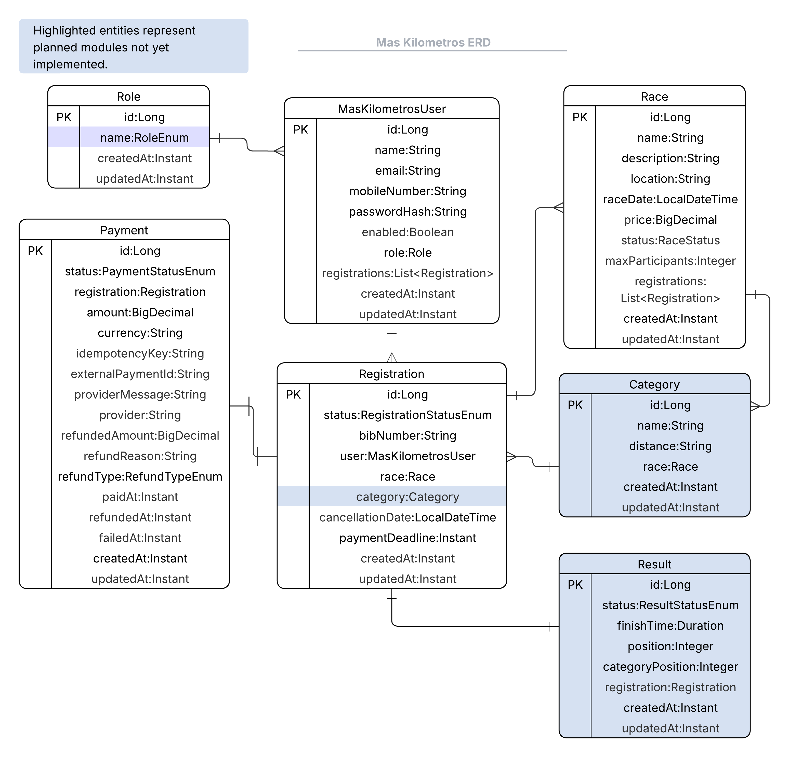

# Backend Race Management Platform

Enterprise-style backend platform for sports race management built with Java and Spring Boot.

Designed to simulate production-oriented backend engineering practices including lifecycle-driven business logic, authentication, validation, scheduled processes, layered architecture, and scalable backend design.

---

## Overview

This platform manages sports race operations for administrators, organizers, and users through secure REST APIs and role-based access control.

The system handles race publication workflows, registrations, payments, automated validations, and operational lifecycle management.

---

## Why This Project

This project originated from a real-world business need in the sports race management domain.

A race organization required a centralized platform to manage races, registrations, participant payments, and operational workflows more efficiently. The platform was designed to address these business requirements while applying enterprise backend engineering practices commonly found in production environments.

Beyond solving operational challenges, the project serves as an opportunity to explore scalable backend architecture, secure application design, lifecycle-driven business processes, and maintainable software engineering principles.

---

## Core Features

### Authentication & Security
- JWT-based authentication
- Stateless security architecture
- Role-based access control (Admin, Organizer, User)
- Secure endpoint authorization
- Ownership validation for protected resources

### Race Management
- Draft, published, closed, and cancelled race lifecycle
- Registration limits and capacity validation
- Race publication workflows
- Dynamic filtering using Spring Specifications

### Registration & Payments
- Registration lifecycle management
- Payment workflow processing
- Payment retry support
- Refund workflows
- Temporal reservation expiration
- Automated scheduler cleanup jobs
- Idempotent payment operations

### Backend Engineering Practices
- DTO-based architecture
- Layered service design
- Global exception handling
- Validation & business rules
- Structured logging
- Aspect-oriented programming (AOP)
- Query optimization
- Fetch planning & JOIN FETCH optimization
- Scheduler-based background processing

---

## Architecture

Feature-based layered architecture:

- controller
- service
- repository
- dto
- entity
- specification
- scheduler
- security
- aspect
- provider

---

## Main Domain Aggregates

- Race
- Registration
- Payment
- User
- Role

---

## Implemented Backend Concepts

- JWT stateless authentication
- Role-based authorization
- Ownership validation
- Lifecycle/state transitions
- Aggregate coordination
- Idempotent workflows
- DTO specialization
- Temporal workflows
- Scheduler jobs
- Dynamic filtering with Specifications
- Fetch optimization
- Refund workflows
- Payment retry workflows
- Reservation expiration workflows
- UTC-based persistence
- Financial state transitions

---

## Engineering Principles

- Clean and maintainable code
- Separation of concerns
- Production-oriented design
- Secure-by-default architecture
- Business-rule driven workflows
- Scalability and extensibility
- Testability and observability

---

## Current Engineering Focus

Currently expanding the platform with:

- Payment retry workflows
- Refund workflow improvements
- Pagination support
- Query optimization
- Result ingestion workflows
- API documentation improvements
- Integration testing
- Scalable backend architecture practices

---

## Planned Improvements

- OpenAPI / Swagger documentation
- Redis-based caching
- Event-driven notifications
- Performance benchmarking
- Advanced integration testing
- Enhanced observability and monitoring
  
---

## Technology Stack

### Backend
- Java
- Spring Boot
- Spring Security
- Spring Data JPA
- Hibernate

### Database & Infrastructure
- MySQL
- Docker
- Docker Compose

### Tools
- Maven
- Git
- Postman
- Bruno

---


## Running Locally

### Start database

```bash
docker compose up -d
```

### Build project

```bash
./mvnw clean install -DskipTests
```

### Run application

```bash
./mvnw spring-boot:run
```

---

## Documentation

This project includes comprehensive functional and backend design documentation covering business requirements, domain modeling, workflows, and architectural decisions.

| Document | Description |
|-----------|-------------|
| 📄 [Functional & Backend Design Document](docs/Mas_Kilometros_Functional_Design.pdf) | System overview, workflows, business rules, domain model, and backend design decisions |
| 📊 [Entity Relationship Diagram (ERD)](docs/ERD.png) | Visual representation of the domain model and entity relationships |

The documentation covers:

- System Overview
- Roles & Responsibilities
- Domain Model
- Entity Relationship Diagram (ERD)
- Authentication Workflow
- Registration & Payment Workflow
- Cancellation Workflow
- Results Processing Workflow
- Business Rules
- Future Enhancements

---

## Entity Relationship Diagram



---

## Project Goals

The goal of this project is to build a production-oriented backend platform capable of supporting real sports race management operations.

The platform focuses on secure authentication, registration workflows, payment processing, operational automation, and scalable backend architecture while following modern enterprise software engineering practices.

As the platform evolves, it is intended to become a practical solution that can be adapted and deployed for real-world race management scenarios.

---

## Status

Project currently under active development.
